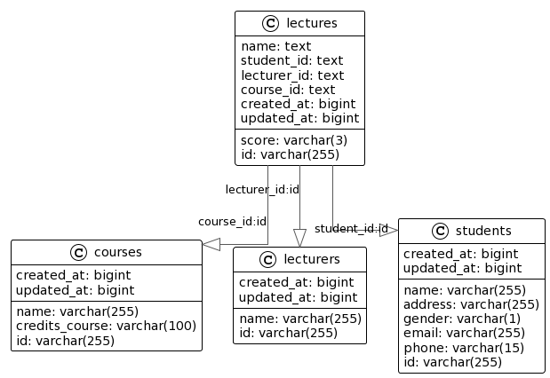

---
# Aplikasi Akademik

## Init Project
Untuk menjalankan project ini ada beberapa hal yang perlu di setting dan di install terlebih dahulu: 
### 1. Install Database
Saya menggunakan 2 database, yaitu postgresql dan redis. postgresql digunakan untuk persistent data sedang kan redis digunakan untuk cache data.
### 2. Menjalankan Aplikasi Manual
Untuk menjalankan aplikasi bisa menggunaka command:
``go run main.go``
di root project nya.

Agar aplikasi berjalan sebagaimana mestinya, berikan value dibawah ini untuk credential nya: 

#### 1. Database

	DB_HOST=
    DB_PORT=
    DB_USER=
    DB_PASSWORD=
    DB_NAME=

contoh:
    
    export DB_HOST=localhost
    export DB_PORT=5432
    export DB_USER=postgres
    export DB_PASSWORD=secret
    export DB_NAME=dot
---
    Create DATABASE dot;
---
Create table MANUALLY

    -- auto-generated definition
    create table courses
    (
    id             varchar(255) not null
    primary key,
    name           varchar(255),
    credits_course varchar(100),
    created_at     bigint,
    updated_at     bigint
    );
    
    alter table courses
    owner to postgres;

    -- auto-generated definition
    create table lecturers
    (
    id         varchar(255) not null
    primary key,
    name       varchar(255),
    created_at bigint,
    updated_at bigint
    );
    
    alter table lecturers
    owner to postgres;
    
    -- auto-generated definition
    create table lectures
    (
    id          varchar(255) not null
    primary key,
    name        text,
    student_id  text,
    lecturer_id text,
    course_id   text,
    score       varchar(3),
    created_at  bigint,
    updated_at  bigint
    );
    
    alter table lectures
    owner to postgres;
    
    -- auto-generated definition
    create table students
    (
    id         varchar(255) not null
    primary key,
    name       varchar(255),
    address    varchar(255),
    gender     varchar(1),
    email      varchar(255),
    phone      varchar(15),
    created_at bigint,
    updated_at bigint
    );
    
    alter table students
    owner to postgres;

Sesuaikan dengan credential yang telah dibuat di postgres nya.

#### 2. Redis
    REDIS_HOST=
    REDIS_HOST=

contoh:

    export REDIS_HOST=localhost
    export REDIS_PORT=6379

#### 3. Aplikasi 
    APP_HOST=
    APP_PORT=

contoh:

    export APP_HOST=localhost
    export APP_PORT=8123

### 3. Menjalankan Aplikasi Dengan docker
Jika sudah menginstall docker dan docker compose, maka bisa menggunakan perintah: 

    docker-compose up

## DB Desain

Untuk relasi antar table nya kurang lebih seperti diatas.

## API Desain
    HOST : 35.188.31.50 
### 1. Student
#### Create Student
    path    : /v1.0/students
    method  : POST
    request body: 
    {
        "name" : "Dot",
        "address" : "jakarta",
        "phone": "089", 
        "email" : "c@mail.com",
        "gender" : "F"
    } 

    response body: 
    {
        "responseCode": "00",
        "responseMessage": "Success",
        "data": {
            "id": "1609444098165444608",
            "name": "Dot",
            "address": "jakarta",
            "gender": "F",
            "email": "c@mail.com",
            "phone": "089",
            "createdAt": 1672556349685,
            "updatedAt": 1672556349685
        }
    }
#### Get Student By ID
    path    : /v1.0/students/{id}
    method  : GET
    request body:
    {}

    response body: 
    {
        "responseCode": "00",
        "responseMessage": "Success",
        "data": {
            "id": "1609419684459843584",
            "name": "Budi",
            "address": "jakarta",
            "gender": "F",
            "email": "c@mail.com",
            "phone": "089",
            "createdAt": 1672550529005,
            "updatedAt": 1672552285555
        }
    }

#### Get All Student
    path    : /v1.0/students
    method  : GET
    request body:
    {}

    response body: 
    {
        "responseCode": "00",
        "responseMessage": "Success",
        "data": [
            {
                "id": "1609419684459843584",
                "name": "Budi",
                "address": "jakarta",
                "gender": "F",
                "email": "c@mail.com",
                "phone": "089",
                "createdAt": 1672550529005,
                "updatedAt": 1672552285555
            },
            {
                "id": "1609444098165444608",
                "name": "Dot",
                "address": "jakarta",
                "gender": "F",
                "email": "c@mail.com",
                "phone": "089",
                "createdAt": 1672556349685,
                "updatedAt": 1672556349685
            }
        ]
    }               

#### Update Student
    path    : /v1.0/students/{id}
    method  : PUT
    request body:

    {
        "name" : "Dot-jkt-2-rfe",
        "address" : "jakarta",
        "phone": "089",
        "email" : "c@mail.com",
        "gender" : "F"
    }

    response body: 
    {
        "responseCode": "00",
        "responseMessage": "Success",
        "data": {
            "id": "1609419684459843584",
            "name": "Dot-jkt-2-rfe",
            "address": "jakarta",
            "gender": "F",
            "email": "c@mail.com",
            "phone": "089",
            "createdAt": 1672550529005,
            "updatedAt": 1672560703094
        }
    }         

#### Delete Student
    path    : /v1.0/students/{id}
    method  : DELETE
    request body:

    {}

    response body: 
    {
        "responseCode": "00",
        "responseMessage": "Success",
        "data": {
            "id": "1609444098165444608",
            "name": "Dot",
            "address": "jakarta",
            "gender": "F",
            "email": "c@mail.com",
            "phone": "089",
            "createdAt": 1672556349685,
            "updatedAt": 1672556349685
        }
    }         

### 2. Course
#### Create Course
    path    : /v1.0/courses
    method  : POST
    request body: 

    {
        "name" : "Dot",
        "creditsCourse" : "3"
    }

    response body: 
    {
        "responseCode": "00",
        "responseMessage": "Success",
        "data": {
            "id": "1609463085146312704",
            "name": "Dot",
            "creditsCourse": "3",
            "createdAt": 1672560876645,
            "updatedAt": 1672560876645
        }
    }
#### Get Course By ID
    path    : /v1.0/courses/{id}
    method  : GET
    request body:
    {}

    response body: 
    {
        "responseCode": "00",
        "responseMessage": "Success",
        "data": {
            "id": "1609463085146312704",
            "name": "Dot",
            "creditsCourse": "3",
            "createdAt": 1672560876645,
            "updatedAt": 1672560876645
        }
    }

#### Get All Course
    path    : /v1.0/courses
    method  : GET
    request body:
    {}

    response body: 
    {
        "responseCode": "00",
        "responseMessage": "Success",
        "data": [
            {
                "id": "1609420923348193280",
                "name": "Dot",
                "creditsCourse": "3",
                "createdAt": 1672550824379,
                "updatedAt": 1672550824379
            },
            {
                "id": "1609444450285654016",
                "name": "Dot",
                "creditsCourse": "3",
                "createdAt": 1672556433639,
                "updatedAt": 1672556433639
            },
            {
                "id": "1609463085146312704",
                "name": "Dot",
                "creditsCourse": "3",
                "createdAt": 1672560876645,
                "updatedAt": 1672560876645
            }
        ]
    }           

#### Update Course
    path    : /v1.0/courses/{id}
    method  : PUT
    request body:

    {
        "name" : "Dot-jkt",
        "creditsCourse" : "3"
    }

    response body: 
    {
        "responseCode": "00",
        "responseMessage": "Success",
        "data": {
            "id": "1609420923348193280",
            "name": "Dot-jkt",
            "createdAt": 1672550824379,
            "updatedAt": 1672550824379
        }
    }       

#### Delete Course
    path    : /v1.0/courses/{id}
    method  : DELETE
    request body:

    {}

    response body: 
    {
        "responseCode": "00",
        "responseMessage": "Success",
        "data": {
            "id": "1609420923348193280",
            "name": "Dot-jkt",
            "createdAt": 1672550824379,
            "updatedAt": 1672550824379
        }
    }        

### 3. Lecture
#### Create Lecture
    path    : /v1.0/lectures
    method  : POST
    request body: 

    {
        "studentId" : "1609419684459843584",
        "lecturerId" : "1609419814097391616",
        "score" : "80",
        "courseId" : "1609463085146312704",
        "name" : "hardian"
    }

    response body:
    {
        "responseCode": "00",
        "responseMessage": "Success",
        "data": {
            "id": "1609464614037229568",
            "studentId": "1609419684459843584",
            "lecturerId": "1609419814097391616",
            "score": "80",
            "name": "hardian",
            "courseId": "1609463085146312704",
            "createdAt": 1672561241171,
            "updatedAt": 1672561241171
        }
    }

#### Get Lecture By ID
    path    : /v1.0/lectures/{id}
    method  : GET
    request body:
    {}

    response body: 
    {
        "responseCode": "00",
        "responseMessage": "Success",
        "data": {
            "id": "1609464614037229568",
            "studentId": "1609419684459843584",
            "lecturerId": "1609419814097391616",
            "score": "80",
            "name": "hardian",
            "courseId": "1609463085146312704",
            "createdAt": 1672561241171,
            "updatedAt": 1672561241171
        }
    }

#### Get All Lecture
    path    : /v1.0/lectures
    method  : GET
    request body:
    {}

    response body: 
    {
        "responseCode": "00",
        "responseMessage": "Success",
        "data": [
            {
                "id": "1609421039840792576",
                "studentId": "1609419684459843584",
                "lecturerId": "1609419814097391616",
                "score": "80",
                "name": "Budi",
                "courseId": "1609420923348193280",
                "createdAt": 1672550852153,
                "updatedAt": 1672550852153
            },
            {
                "id": "1609447758937198592",
                "studentId": "1609419684459843584",
                "lecturerId": "1609419814097391616",
                "score": "80",
                "name": "hardian",
                "courseId": "1609420923348193280",
                "createdAt": 1672557222481,
                "updatedAt": 1672557222481
            },
            {
                "id": "1609419901586378752",
                "studentId": "1609419684459843584",
                "lecturerId": "1609419814097391616",
                "score": "99",
                "courseId": "1609419850428452864",
                "createdAt": 1672550580774,
                "updatedAt": 1672550580774
            },
            {
                "id": "1609464614037229568",
                "studentId": "1609419684459843584",
                "lecturerId": "1609419814097391616",
                "score": "80",
                "name": "hardian",
                "courseId": "1609463085146312704",
                "createdAt": 1672561241171,
                "updatedAt": 1672561241171
            }
        ]
    }          

#### Update Lecture score
    path    : /v1.0/lectures/{id}
    method  : PATCH
    request body:

    {
        "score" : "99"
    }

    response body: 
    {
        "responseCode": "00",
        "responseMessage": "Success",
        "data": {
            "score": "99"
        }
    }      

#### Update Lecture Name - Transactional
    path    : /v1.0/lectures/{id}
    method  : PATCH
    request body:

    {
        "name" : "Budi"
    }

    response body: 
    {
        "responseCode": "00",
        "responseMessage": "Success",
        "data": {
            "id": "1609421039840792576",
            "studentId": "1609419684459843584",
            "lecturerId": "1609419814097391616",
            "score": "80",
            "name": "Budi",
            "courseId": "1609420923348193280",
            "createdAt": 1672550852153,
            "updatedAt": 1672550852153
        }
    }  

#### Delete Lecture
    path    : /v1.0/lectures/{id}
    method  : DELETE
    request body:

    {}

    response body: 
    {
        "responseCode": "00",
        "responseMessage": "Success",
        "data": {
            "id": "1609421039840792576",
            "studentId": "1609419684459843584",
            "lecturerId": "1609419814097391616",
            "score": "80",
            "name": "Budi",
            "courseId": "1609420923348193280",
            "createdAt": 1672550852153,
            "updatedAt": 1672550852153
        }
    }       

### 4. Lecturer
#### Create Lecturer
    path    : /v1.0/lecturers
    method  : POST
    request body: 

    {
        "name" : "Dimas"
    }

    response body: 
    {
        "responseCode": "00",
        "responseMessage": "Success",
        "data": {
            "id": "1609466064142340096",
            "name": "Dimas",
            "createdAt": 1672561586860,
            "updatedAt": 1672561586860
        }
    }
#### Get Lecturer By ID
    path    : /v1.0/lecturers/{id}
    method  : GET
    request body:
    {}

    response body: 
    {
        "responseCode": "00",
        "responseMessage": "Success",
        "data": {
            "id": "1609466064142340096",
            "name": "Dimas",
            "createdAt": 1672561586860,
            "updatedAt": 1672561586860
        }
    }

#### Get All Lecturer
    path    : /v1.0/lecturers
    method  : GET
    request body:
    {}

    response body: 
    {
        "responseCode": "00",
        "responseMessage": "Success",
        "data": [
            {
                "studentId": "1609446935440134144",
                "name": "Dimas",
                "createdAt": 1672557026145,
                "updatedAt": 1672557026145
            },
            {
                "studentId": "1609419814097391616",
                "name": "Dimas Back",
                "createdAt": 1672550559915,
                "updatedAt": 1672557200485
            },
            {
                "studentId": "1609464336189755392",
                "name": "Dimas",
                "createdAt": 1672561174925,
                "updatedAt": 1672561174925
            },
            {
                "studentId": "1609466064142340096",
                "name": "Dimas",
                "createdAt": 1672561586860,
                "updatedAt": 1672561586860
            }
        ]
    }        

#### Update Lecturer
    path    : /v1.0/lecturers/{id}
    method  : PUT
    request body:

    {
        "name" : "Dimas Back"
    }

    response body: 
    {
        "responseCode": "00",
        "responseMessage": "Success",
        "data": {
            "id": "1609419814097391616",
            "name": "Dimas Back",
            "createdAt": 1672550559915,
            "updatedAt": 1672561724515
        }
    }   

#### Delete Lecturer
    path    : /v1.0/lecturers/{id}
    method  : DELETE
    request body:

    {}

    response body: 
    {
        "responseCode": "00",
        "responseMessage": "Success",
        "data": {
            "id": "1609419814097391616",
            "name": "Dimas Back",
            "createdAt": 1672550559915,
            "updatedAt": 1672561724515
        }
    }       

## Error code

| responseCode | responseMessagee | Description| 
|--------------|------------------|------------|
| 00           | Success          | Sukses|
| 99           | Not Found        | Gagal|
| 99           |Invalid Request       | Gagal|
| 99           | Bad Request       | Gagal|
| 99           | General error       | Gagal|

## Pattern yang digunakan
Didalam project ini saya menggunakan beberapa pattern agar code yang saya buat lebih mudah untuk di maintain. 
### Creational
#### Singleton 
Digunakan untuk koneksi ke database redis dan postgres, Supaya open close koneksi cukup 1 instance saja.
#### Builder
Digunakan untuk mem-build response.

### Behavioural
#### Decorator
Saya menggunakan Decorator untuk Behavioural pattern, karena lebih flexible dari pada static instance.

### Structural
#### Adaptor
Saya menggunakan nya untuk mendapatkan standard response. Agar bisa membuat response terpusat

----